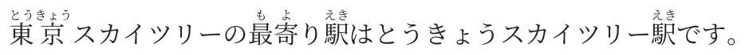
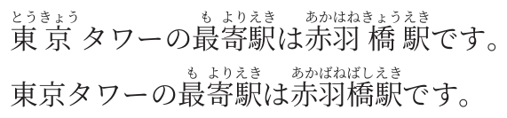
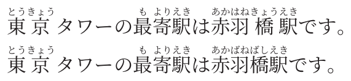
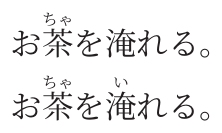
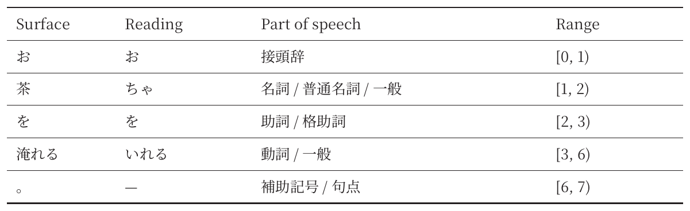

# minitype-plugin-rubinate

Rubinate is a [minitype](https://typeset.jp) plugin for automatic Japanese ruby, using Lindera and reading correspondence dictionaries.

Rubinate returns standard minitype ruby inlines. minitype handles typography, line breaking and page layout.

## Installation

This package is not yet published to npm. Build and pack this checkout:

```sh
npm ci
npm pack
```

Then install the archive in your document project:

```sh
npm install /path/to/minitype-plugin-rubinate-0.1.0.tgz @minitype/minitype
```

## Quick start

Save as `index.ts`:

```ts
import { minitype, p } from "@minitype/minitype";
import { createRubinate } from "minitype-plugin-rubinate";

const r = createRubinate();
const paragraph = p([
  await r.autoRuby("東京スカイツリーの最寄り駅はとうきょうスカイツリー駅です。"),
]);

await minitype([{ body: [paragraph] }]).save("output.pdf");
```



Run:

```sh
npx tsx index.ts
```

<details>
<summary>Project setup</summary>

Use `"type": "module"` in `package.json` and install tsx with `npm install --save-dev tsx` if needed.

</details>

Await `autoRuby()` before passing its result to minitype. `p()` expects an array of lines, so wrap the returned inline array: `p([await r.autoRuby(text)])`. The tagged form `` p`${await r.autoRuby(text)}` `` is also supported.

See the [documentation](docs/documentation.pdf) for executable examples, their rendered results and the complete public API.

## TSX

With [@minitype/tsx](https://github.com/minitype-project/tsx) 0.1.1, use `<AutoRuby>` for automatic ruby inside JSX. Install the JSX runtime in your document project:

```sh
npm install @minitype/tsx
```

Add these settings to `tsconfig.json`:

```json
{
  "compilerOptions": {
    "jsx": "react-jsx",
    "jsxImportSource": "@minitype/tsx"
  }
}
```

Save as `index.tsx`:

```tsx
import { Document, Group, P, minitypeJSX } from "@minitype/tsx";
import { AutoRuby } from "minitype-plugin-rubinate/tsx";

const document = (
  <Document>
    <Group>
      <P>
        <AutoRuby>東京スカイツリーの最寄り駅はとうきょうスカイツリー駅です。</AutoRuby>
      </P>
    </Group>
  </Document>
);
await minitypeJSX(document).save("output.pdf");
```


Run with `npx tsx index.tsx`. `AutoRuby` performs its analysis synchronously while JSX is evaluated, so no resolver or document traversal step is required before `minitypeJSX`.

Pass `dictionary`, `kana`, `granularity`, `readings`, `correspondence`, `userDictionary` or `userDictionaryPath` as props. For shared defaults, import `createAutoRuby` and create a component such as `const UnidicRuby = createAutoRuby({ dictionary: "unidic" })`; element props override those defaults. Synchronous custom tokenizers are also supported by `createAutoRuby`. The normal `createRubinate`/`autoRuby` API remains asynchronous and continues to accept async custom tokenizers. `AutoRuby` accepts text, interpolated numbers, arrays of text and conditional empty values. Place styled elements around it and manual ruby elements beside it. Nested JSX elements inside `AutoRuby` are rejected.

A complete example is in [examples/tsx.tsx](examples/tsx.tsx); run it from this checkout with `npm run example:tsx`.

## API

| Method | Result | Purpose |
| --- | --- | --- |
| `createRubinate(config?)` | `Rubinate` | Create an instance with shared defaults |
| `r.autoRuby(text, options?)` | `Promise<(string \| Ruby)[]>` | Produce minitype ruby inlines |
| `r.analyze(text, options?)` | `Promise<AnalyzedToken[]>` | Inspect tokens, readings and dictionary correspondence |
| `r.segments(text, options?)` | `Promise<Segment[]>` | Get `{ text, reading? }` parts for other renderers |
| `alignReading(surface, reading)` | `Segment[]` | Align kana without loading a dictionary |

`autoRuby`, `analyze` and `segments` are also top-level imports using a shared default instance. To use a shorter local name, import `autoRuby as ruby` from `minitype-plugin-rubinate`; keep it distinct from minitype's manual `ruby` helper. See the [public types](src/index.ts) and [manual](docs/documentation.pdf).

## Readings

For a reading specified directly in your document, use minitype's `ruby()`. Leave text unannotated by writing it as a plain string, and use Rubinate for the parts that need automatic readings:

```ts
import { p, ruby } from "@minitype/minitype";

const sample = "東京タワーの最寄駅は赤羽橋駅です。";
const paragraph = p([
  [...await r.autoRuby(sample)],
  ["東京タワー", ...await r.autoRuby("の最寄駅は"),
    ruby("赤羽橋駅", "あかばねばしえき"), "です。"],
]);
```

Use `readings` when processing an existing text string or applying the same reading to matching surfaces throughout the input. `null` suppresses ruby for that surface:

```ts
const sample = "東京タワーの最寄駅は赤羽橋駅です。";
const annotated = await r.autoRuby(sample, {
  readings: { "赤羽橋駅": "あかばねばしえき", "東京タワー": null },
});
const paragraph = p([
  [...await r.autoRuby(sample)],
  [...annotated],
]);
```

Both examples above show the original result first and the edited result below:



Overrides choose the longest match and bypass dictionary correspondence. They divide the surrounding text into separately analyzed chunks.

## User dictionaries

Use a user dictionary when the existing dictionary gives an incorrect reading or word boundary. Each CSV row is `surface,part-of-speech,reading`. Here, the default analyzer reads 赤羽橋駅 as あかはねきょうえき; the user entry corrects it to あかばねばしえき.

```ts
const r = createRubinate({
  userDictionary: "赤羽橋駅,カスタム名詞,アカバネバシエキ",
});
const sample = "東京タワーの最寄駅は赤羽橋駅です。";
const paragraph = p([
  [...await r.autoRuby(sample, { userDictionary: "" })],
  [...await r.autoRuby(sample)],
]);
```

For an external UTF-8 file, save the following as `dictionary.csv` (no header):

```csv
赤羽橋駅,カスタム名詞,アカバネバシエキ
```

```ts
const r = createRubinate({ userDictionaryPath: "./dictionary.csv" });
const sample = "東京タワーの最寄駅は赤羽橋駅です。";
const paragraph = p([
  [...await r.autoRuby(sample, { userDictionary: "" })],
  [...await r.autoRuby(sample)],
]);
```

Both CSV methods produce the same comparison: before applying the user dictionary on top, and after applying it below:



`userDictionaryPath` accepts a filesystem path or a `file:` URL, including `new URL("./dictionary.csv", import.meta.url)` for a path relative to your script. String paths are relative to the working directory. The file is read on each call; UTF-8 BOM is accepted. File access and CSV validation errors reject the call. Specify either `userDictionary` or `userDictionaryPath` in the same configuration, not both. A call-level source replaces either instance source; `userDictionary: ""` disables the instance dictionary for that call. 

Quoted fields and CRLF are supported. Invalid rows reject before entering WASM.

## Choosing a dictionary

IPADIC remains the default. In the bundled dictionaries, IPADIC leaves 淹 in お茶を淹れる。 unannotated, while UniDic supplies the reading い. The first line below uses IPADIC; the second uses UniDic.

```ts
const r = createRubinate({ dictionary: "unidic" });
const sample = "お茶を淹れる。";
const paragraph = p([
  [...await r.autoRuby(sample, { dictionary: "ipadic" })],
  [...await r.autoRuby(sample)],
]);
```



The dictionaries differ in vocabulary and tokenization; UniDic is not necessarily more accurate for every sentence. Both support user dictionaries, explicit readings and kana options. See the [manual](docs/documentation.pdf) for analysis fields and reading reconstruction.

## Analysis table

Use `analyze()` to inspect token boundaries, readings and parts of speech, then pass the rows to minitype's `table()`. The range column uses UTF-16 offsets with an exclusive end; `—` indicates a missing reading or part of speech.

```ts
import { p, table } from "@minitype/minitype";
import { createRubinate } from "minitype-plugin-rubinate";

const r = createRubinate({ dictionary: "unidic" });
const tokens = await r.analyze("お茶を淹れる。");
const rows = [
  ["Surface", "Reading", "Part of speech", "Range"],
  ...tokens.map(t => [
    t.surface, t.reading || "—",
    t.partOfSpeech?.filter(s => s !== "*").join(" / ") || "—",
    `[${t.start}, ${t.end})`,
  ]),
];
const analysisTable = table(rows.map(row => row.map(cell => ({
  type: "tableCell",
  block: p(cell, { size: 3.2, lineHeight: 5, align: "left", indent: 0, firstIndent: 0 })
}))), {
  columnWidths: [24, 30, 65, 30],
  cellPadding: { type: "physical", top: 2, bottom: 2, left: 2, right: 2 },
});
```



Pass `analysisTable` as a block in your document's `body`.

## Ruby options and styling

| Option | Default | Behavior |
| --- | --- | --- |
| `dictionary` | `"ipadic"` | `"ipadic"` or `"unidic"`; shared defaults and per-call selection |
| `kana` | `"hiragana"` | Hiragana or `"katakana"` readings |
| `granularity` | `"kanji"` | Correspondence with okurigana separated; `"word"` annotates whole tokens |
| `correspondence` | `true` | Look up JmdictFurigana and JmnedictFurigana |
| `readings` | `{}` | Exact reading overrides or exclusions |
| `userDictionary` | omitted | Additional entries in three-column CSV |
| `userDictionaryPath` | omitted | UTF-8 CSV file path or `file:` URL |

In the examples above, `東京` receives per-character ruby as `東(とう)京(きょう)`, while the user dictionary annotates `赤羽橋駅` as a whole with `あかばねばしえき`. With UniDic, `淹れる` becomes `淹(い)れる`, leaving the okurigana unannotated. Characters without a reading remain unchanged, as with `淹` in the IPADIC example. The original text, including whitespace, is preserved.

Set `rubySize`, `rubyOffset`, `rubyFont`, `rubyAlign` and `lineHeight` with minitype's paragraph styles. The manual compares hiragana and katakana and explains style settings and token inspection.

## Scope and runtime

Rubinate uses IPADIC and UniDic analyzers, okurigana alignment and furigana correspondence modules with a direct JavaScript–WASM buffer ABI. Each annotated segment becomes a native minitype ruby inline. `rubyKind` is informational classification returned by analysis; it does not control grouping or layout.

The WASM assets are about 11 MiB for IPADIC, 44 MiB for UniDic and 5.4 MiB for correspondence. All are packaged, but only the selected analyzer loads. They load lazily and are shared per process. Processing is synchronous inside the async API; a worker is appropriate when event-loop latency matters. `config.tokenizer` can replace the analyzer; see the manual's custom tokenizer example and contract.

## Development and documentation

```sh
npm test                 # Build, type-check and run regression tests
npm run example          # Generate output/pdf/rubinate-example.pdf
npm run documentation    # Execute examples and build docs/documentation.pdf
npm run documentation:images # Regenerate standalone README images
npm pack                 # Package binaries, sources and documentation
```

The documentation follows the Quick Start / Usage / Public API / License structure, with a layout adapted from [minitype-plugin-chemagram](https://github.com/rice8y/minitype-plugin-chemagram). Listings are extracted from the same TypeScript functions that produce the rendered examples. See [docs/README.md](docs/README.md) for its source structure.

Exact binary hashes and source provenance are in [assets/manifest.json](assets/manifest.json). The package maintains the corresponding Rust sources and dictionary data under [wasm-plugins](wasm-plugins). Optional WASM rebuild instructions are in the manual.

## License

Rubinate is licensed under [MIT](LICENSE). Correspondence data is CC BY-SA 4.0. UniDic uses its BSD-3-Clause option; IPADIC and Lindera retain their respective notices. minitype 0.1.6 uses a separate PolyForm Noncommercial license.

See [THIRD_PARTY_NOTICES.md](THIRD_PARTY_NOTICES.md) for attribution and the host dependency audit status.

Rubinate provides automatic Japanese ruby functionality equivalent to [auto-jrubby](https://github.com/rice8y/auto-jrubby), with ruby layout handled by minitype.
